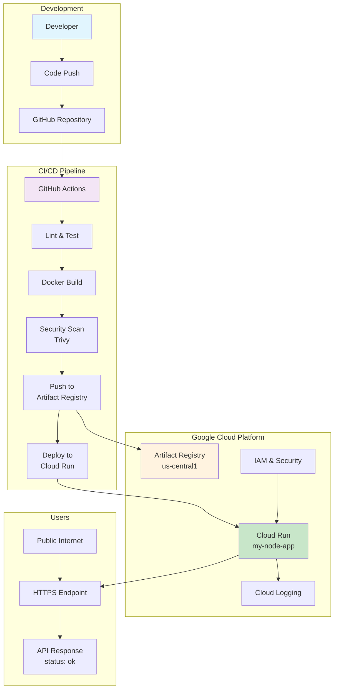

# Architecture Overview

## System Architecture Diagram

## Component Description

### Development Layer

- **Developer**: Writes code and pushes changes
- **GitHub Repository**: Version control and source of truth

### CI/CD Pipeline

- **GitHub Actions**: Automated workflow orchestration
- **Lint & Test**: Code quality and correctness validation
- **Docker Build**: Container image creation
- **Security Scan**: Vulnerability assessment with Trivy
- **Artifact Registry**: Secure container image storage
- **Cloud Run Deployment**: Serverless application hosting

### Google Cloud Platform

- **Artifact Registry**: Private Docker registry in us-central1
- **Cloud Run**: Managed serverless compute platform
- **Cloud Logging**: Centralized log aggregation
- **IAM & Security**: Identity and access management

### User Access

- **Public Internet**: External user access
- **HTTPS Endpoint**: Secure API endpoint
- **API Response**: JSON response with application status

## Data Flow

1. Developer pushes code to GitHub repository
2. GitHub Actions triggers automated CI/CD pipeline
3. Pipeline runs tests, builds Docker image, and scans for vulnerabilities
4. Secure image is pushed to Google Artifact Registry
5. Cloud Run service is updated with new image
6. Users access the API via HTTPS endpoint
7. Application logs are automatically sent to Cloud Logging
8. IAM controls access to all GCP resources

## Security Considerations

- **Non-root containers**: Application runs with limited privileges
- **Private registry**: Images stored in secure Artifact Registry
- **Secret management**: Credentials managed via GitHub Secrets
- **HTTPS by default**: All traffic encrypted in transit
- **Vulnerability scanning**: Automated security assessment
